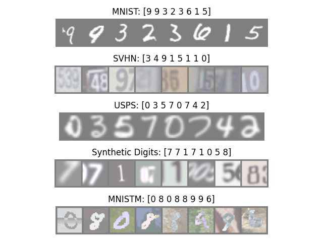

# Bayesian Variation Inference based Federated Learning


## Datasets
MNIST, SVHN, USPS, Synthetic Digits and MNIST-M

<center>

</center>

### Download datasets
```bash
$ cd Code/datasets
$ python download_datasets.py
$ cd ../..
```
## Experiments
```bash
$ cd Code/train
$ python fedavg.py --num-rounds 50 --num-epochs 1 --num-data-mnist 60000 --num-data-svhn 73257 --num-data-usps 7291 --num-data-synth 479400 --num-data-mnistm 60000
```


```bash
CUDA_VISIBLE_DEVICES=1 nohup python -u ./fedavg.py --log --num-rounds 50 --num-epochs 1 --num-data-mnist 60000 --num-data-svhn 73257 --num-data-usps 7291 --num-data-synth 479400 --num-data-mnistm 60000 &> ./nohup_files/fedavg_full_bias_50_1.out &
CUDA_VISIBLE_DEVICES=1 nohup python -u ./fedavg.py --log --num-rounds 10 --num-epochs 5 --num-data-mnist 60000 --num-data-svhn 73257 --num-data-usps 7291 --num-data-synth 479400 --num-data-mnistm 60000 &> ./nohup_files/fedavg_full_bias_10_5.out &
CUDA_VISIBLE_DEVICES=1 nohup python -u ./fedavg.py --log --num-rounds 50 --num-epochs 1 --num-data-mnist 7291 --num-data-svhn 7291 --num-data-usps 7291 --num-data-synth 7291 --num-data-mnistm 7291 &> ./nohup_files/fedavg_full_unbias_50_1.out &
CUDA_VISIBLE_DEVICES=1 nohup python -u ./fedavg.py --log --num-rounds 10 --num-epochs 5 --num-data-mnist 7291 --num-data-svhn 7291 --num-data-usps 7291 --num-data-synth 7291 --num-data-mnistm 7291 &> ./nohup_files/fedavg_full_unbias_10_5.out &

CUDA_VISIBLE_DEVICES=1 nohup python -u ./fedprox.py --log --num-rounds 50 --num-epochs 1 --num-data-mnist 60000 --num-data-svhn 73257 --num-data-usps 7291 --num-data-synth 479400 --num-data-mnistm 60000 &> ./nohup_files/fedprox_full_bias_50_1.out &
CUDA_VISIBLE_DEVICES=1 nohup python -u ./fedprox.py --log --num-rounds 10 --num-epochs 5 --num-data-mnist 60000 --num-data-svhn 73257 --num-data-usps 7291 --num-data-synth 479400 --num-data-mnistm 60000 &> ./nohup_files/fedprox_full_bias_10_5.out &
CUDA_VISIBLE_DEVICES=1 nohup python -u ./fedprox.py --log --num-rounds 50 --num-epochs 1 --num-data-mnist 7291 --num-data-svhn 7291 --num-data-usps 7291 --num-data-synth 7291 --num-data-mnistm 7291 &> ./nohup_files/fedprox_full_unbias_50_1.out &
CUDA_VISIBLE_DEVICES=1 nohup python -u ./fedprox.py --log --num-rounds 10 --num-epochs 5 --num-data-mnist 7291 --num-data-svhn 7291 --num-data-usps 7291 --num-data-synth 7291 --num-data-mnistm 7291 &> ./nohup_files/fedprox_full_unbias_10_5.out &

CUDA_VISIBLE_DEVICES=1 nohup python -u ./fedbn.py --log --num-rounds 50 --num-epochs 1 --num-data-mnist 60000 --num-data-svhn 73257 --num-data-usps 7291 --num-data-synth 479400 --num-data-mnistm 60000 &> ./nohup_files/fedbn_full_bias_50_1.out &
CUDA_VISIBLE_DEVICES=1 nohup python -u ./fedbn.py --log --num-rounds 10 --num-epochs 5 --num-data-mnist 60000 --num-data-svhn 73257 --num-data-usps 7291 --num-data-synth 479400 --num-data-mnistm 60000 &> ./nohup_files/fedbn_full_bias_10_5.out &
CUDA_VISIBLE_DEVICES=1 nohup python -u ./fedbn.py --log --num-rounds 50 --num-epochs 1 --num-data-mnist 7291 --num-data-svhn 7291 --num-data-usps 7291 --num-data-synth 7291 --num-data-mnistm 7291 &> ./nohup_files/fedbn_full_unbias_50_1.out &
CUDA_VISIBLE_DEVICES=1 nohup python -u ./fedbn.py --log --num-rounds 10 --num-epochs 5 --num-data-mnist 7291 --num-data-svhn 7291 --num-data-usps 7291 --num-data-synth 7291 --num-data-mnistm 7291 &> ./nohup_files/fedbn_full_unbias_10_5.out &

CUDA_VISIBLE_DEVICES=1 nohup python -u ./single.py --log --num-rounds 50 --num-epochs 1 --num-data-mnist 60000 --num-data-svhn 73257 --num-data-usps 7291 --num-data-synth 479400 --num-data-mnistm 60000 &> ./nohup_files/single_full_bias_50_1.out &
CUDA_VISIBLE_DEVICES=1 nohup python -u ./single.py --log --num-rounds 50 --num-epochs 1 --num-data-mnist 7291 --num-data-svhn 7291 --num-data-usps 7291 --num-data-synth 7291 --num-data-mnistm 7291 &> ./nohup_files/single_full_unbias_50_1.out &

# TODO
CUDA_VISIBLE_DEVICES=3 nohup python -u ./fola.py --log --num-rounds 50 --num-epochs 1 --num-data-mnist 60000 --num-data-svhn 73257 --num-data-usps 7291 --num-data-synth 479400 --num-data-mnistm 60000 --csd-importance 0.1 --clip 10 &> ./nohup_files/fola_full_bias_50_1_csd_1.out &
CUDA_VISIBLE_DEVICES=3 nohup python -u ./fola.py --log --num-rounds 10 --num-epochs 5 --num-data-mnist 60000 --num-data-svhn 73257 --num-data-usps 7291 --num-data-synth 479400 --num-data-mnistm 60000 --csd-importance 0.1 --clip 10 &> ./nohup_files/fola_full_bias_10_5_csd_1.out &
CUDA_VISIBLE_DEVICES=3 nohup python -u ./fola.py --log --num-rounds 50 --num-epochs 1 --num-data-mnist 7291 --num-data-svhn 7291 --num-data-usps 7291 --num-data-synth 7291 --num-data-mnistm 7291 --csd-importance 0.1 --clip 10 &> ./nohup_files/fola_full_unbias_50_1_csd_1.out &
CUDA_VISIBLE_DEVICES=3 nohup python -u ./fola.py --log --num-rounds 10 --num-epochs 5 --num-data-mnist 7291 --num-data-svhn 7291 --num-data-usps 7291 --num-data-synth 7291 --num-data-mnistm 7291 --csd-importance 0.1 --clip 10 &> ./nohup_files/fola_full_unbias_10_5_csd_1.out &

# TODO
CUDA_VISIBLE_DEVICES=1 nohup python -u ./fola.py --log --num-rounds 50 --num-epochs 1 --num-data-mnist 60000 --num-data-svhn 73257 --num-data-usps 7291 --num-data-synth 479400 --num-data-mnistm 60000 --csd-importance 0.0 --clip 10 &> ./nohup_files/fola_full_bias_50_1_csd_0.out &
CUDA_VISIBLE_DEVICES=1 nohup python -u ./fola.py --log --num-rounds 10 --num-epochs 5 --num-data-mnist 60000 --num-data-svhn 73257 --num-data-usps 7291 --num-data-synth 479400 --num-data-mnistm 60000 --csd-importance 0.0 --clip 10 &> ./nohup_files/fola_full_bias_10_5_csd_0.out &
CUDA_VISIBLE_DEVICES=1 nohup python -u ./fola.py --log --num-rounds 50 --num-epochs 1 --num-data-mnist 7291 --num-data-svhn 7291 --num-data-usps 7291 --num-data-synth 7291 --num-data-mnistm 7291 --csd-importance 0.0 --clip 10 &> ./nohup_files/fola_full_unbias_50_1_csd_0.out &
CUDA_VISIBLE_DEVICES=1 nohup python -u ./fola.py --log --num-rounds 10 --num-epochs 5 --num-data-mnist 7291 --num-data-svhn 7291 --num-data-usps 7291 --num-data-synth 7291 --num-data-mnistm 7291 --csd-importance 0.0 --clip 10 &> ./nohup_files/fola_full_unbias_10_5_csd_0.out &

% Partial
CUDA_VISIBLE_DEVICES=3 nohup python -u ./fedavg.py --log --num-rounds 50 --num-epochs 1 --num-data-mnist 6000 --num-data-svhn 7325 --num-data-usps 729 --num-data-synth 47940 --num-data-mnistm 6000 &> ./nohup_files/fedavg_partial_bias_50_1.out &
CUDA_VISIBLE_DEVICES=3 nohup python -u ./fedavg.py --log --num-rounds 10 --num-epochs 5 --num-data-mnist 6000 --num-data-svhn 7325 --num-data-usps 729 --num-data-synth 47940 --num-data-mnistm 6000 &> ./nohup_files/fedavg_partial_bias_10_5.out &
CUDA_VISIBLE_DEVICES=3 nohup python -u ./fedavg.py --log --num-rounds 50 --num-epochs 1 --num-data-mnist 729 --num-data-svhn 729 --num-data-usps 729 --num-data-synth 729 --num-data-mnistm 729 &> ./nohup_files/fedavg_partial_unbias_50_1.out &
CUDA_VISIBLE_DEVICES=3 nohup python -u ./fedavg.py --log --num-rounds 10 --num-epochs 5 --num-data-mnist 729 --num-data-svhn 729 --num-data-usps 729 --num-data-synth 729 --num-data-mnistm 729 &> ./nohup_files/fedavg_partial_unbias_10_5.out &

CUDA_VISIBLE_DEVICES=3 nohup python -u ./fedprox.py --log --num-rounds 50 --num-epochs 1 --num-data-mnist 6000 --num-data-svhn 7325 --num-data-usps 729 --num-data-synth 47940 --num-data-mnistm 6000 &> ./nohup_files/fedprox_partial_bias_50_1.out &
CUDA_VISIBLE_DEVICES=3 nohup python -u ./fedprox.py --log --num-rounds 10 --num-epochs 5 --num-data-mnist 6000 --num-data-svhn 7325 --num-data-usps 729 --num-data-synth 47940 --num-data-mnistm 6000 &> ./nohup_files/fedprox_partial_bias_10_5.out &
CUDA_VISIBLE_DEVICES=3 nohup python -u ./fedprox.py --log --num-rounds 50 --num-epochs 1 --num-data-mnist 729 --num-data-svhn 729 --num-data-usps 729 --num-data-synth 729 --num-data-mnistm 729 &> ./nohup_files/fedprox_partial_unbias_50_1.out &
CUDA_VISIBLE_DEVICES=3 nohup python -u ./fedprox.py --log --num-rounds 10 --num-epochs 5 --num-data-mnist 729 --num-data-svhn 729 --num-data-usps 729 --num-data-synth 729 --num-data-mnistm 729 &> ./nohup_files/fedprox_partial_unbias_10_5.out &

CUDA_VISIBLE_DEVICES=1 nohup python -u ./fedbn.py --log --num-rounds 50 --num-epochs 1 --num-data-mnist 6000 --num-data-svhn 7325 --num-data-usps 729 --num-data-synth 47940 --num-data-mnistm 6000 &> ./nohup_files/fedbn_partial_bias_50_1.out &
CUDA_VISIBLE_DEVICES=1 nohup python -u ./fedbn.py --log --num-rounds 10 --num-epochs 5 --num-data-mnist 6000 --num-data-svhn 7325 --num-data-usps 729 --num-data-synth 47940 --num-data-mnistm 6000 &> ./nohup_files/fedbn_partial_bias_10_5.out &
CUDA_VISIBLE_DEVICES=1 nohup python -u ./fedbn.py --log --num-rounds 50 --num-epochs 1 --num-data-mnist 729 --num-data-svhn 729 --num-data-usps 729 --num-data-synth 729 --num-data-mnistm 729 &> ./nohup_files/fedbn_partial_unbias_50_1.out &
CUDA_VISIBLE_DEVICES=1 nohup python -u ./fedbn.py --log --num-rounds 10 --num-epochs 5 --num-data-mnist 729 --num-data-svhn 729 --num-data-usps 729 --num-data-synth 729 --num-data-mnistm 729 &> ./nohup_files/fedbn_partial_unbias_10_5.out &

CUDA_VISIBLE_DEVICES=1 nohup python -u ./single.py --log --num-rounds 50 --num-epochs 1 --num-data-mnist 6000 --num-data-svhn 7325 --num-data-usps 729 --num-data-synth 47940 --num-data-mnistm 6000 &> ./nohup_files/single_partial_bias_50_1.out &
CUDA_VISIBLE_DEVICES=1 nohup python -u ./single.py --log --num-rounds 50 --num-epochs 1 --num-data-mnist 729 --num-data-svhn 729 --num-data-usps 729 --num-data-synth 729 --num-data-mnistm 729 &> ./nohup_files/single_partial_unbias_50_1.out &

CUDA_VISIBLE_DEVICES=3 nohup python -u ./fola.py --log --num-rounds 50 --num-epochs 1 --num-data-mnist 6000 --num-data-svhn 7325 --num-data-usps 729 --num-data-synth 47940 --num-data-mnistm 6000 --csd-importance 0.1 --clip 10 &> ./nohup_files/fola_partial_bias_50_1_csd_1.out &
CUDA_VISIBLE_DEVICES=3 nohup python -u ./fola.py --log --num-rounds 10 --num-epochs 5 --num-data-mnist 6000 --num-data-svhn 7325 --num-data-usps 729 --num-data-synth 47940 --num-data-mnistm 6000 --csd-importance 0.1 --clip 10 &> ./nohup_files/fola_partial_bias_10_5_csd_1.out &
CUDA_VISIBLE_DEVICES=3 nohup python -u ./fola.py --log --num-rounds 50 --num-epochs 1 --num-data-mnist 729 --num-data-svhn 729 --num-data-usps 729 --num-data-synth 729 --num-data-mnistm 729 --csd-importance 0.1 --clip 10 &> ./nohup_files/fola_partial_unbias_50_1_csd_1.out &
CUDA_VISIBLE_DEVICES=3 nohup python -u ./fola.py --log --num-rounds 10 --num-epochs 5 --num-data-mnist 729 --num-data-svhn 729 --num-data-usps 729 --num-data-synth 729 --num-data-mnistm 729 --csd-importance 0.1 --clip 10 &> ./nohup_files/fola_partial_unbias_10_5_csd_1.out &

CUDA_VISIBLE_DEVICES=3 nohup python -u ./fola.py --log --num-rounds 50 --num-epochs 1 --num-data-mnist 6000 --num-data-svhn 7325 --num-data-usps 729 --num-data-synth 47940 --num-data-mnistm 6000 --csd-importance 0.0 --clip 10 &> ./nohup_files/fola_partial_bias_50_1_csd_0.out &
CUDA_VISIBLE_DEVICES=3 nohup python -u ./fola.py --log --num-rounds 10 --num-epochs 5 --num-data-mnist 6000 --num-data-svhn 7325 --num-data-usps 729 --num-data-synth 47940 --num-data-mnistm 6000 --csd-importance 0.0 --clip 10 &> ./nohup_files/fola_partial_bias_10_5_csd_0.out &
CUDA_VISIBLE_DEVICES=3 nohup python -u ./fola.py --log --num-rounds 50 --num-epochs 1 --num-data-mnist 729 --num-data-svhn 729 --num-data-usps 729 --num-data-synth 729 --num-data-mnistm 729 --csd-importance 0.0 --clip 10 &> ./nohup_files/fola_partial_unbias_50_1_csd_0.out &
CUDA_VISIBLE_DEVICES=3 nohup python -u ./fola.py --log --num-rounds 10 --num-epochs 5 --num-data-mnist 729 --num-data-svhn 729 --num-data-usps 729 --num-data-synth 729 --num-data-mnistm 729 --csd-importance 0.0 --clip 10 &> ./nohup_files/fola_partial_unbias_10_5_csd_0.out &
```


## Results

python pfedbayes.py --log --num-rounds 10 --num-epochs 5 --num-data-mnist 729 --num-data-svhn 729 --num-data-usps 729 --num-data-synth 729 --num-data-mnistm 729 --importance-bayes 1.0
